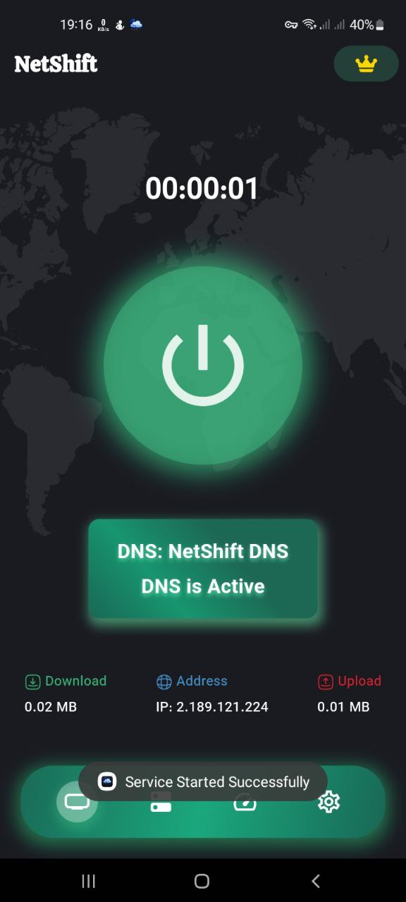
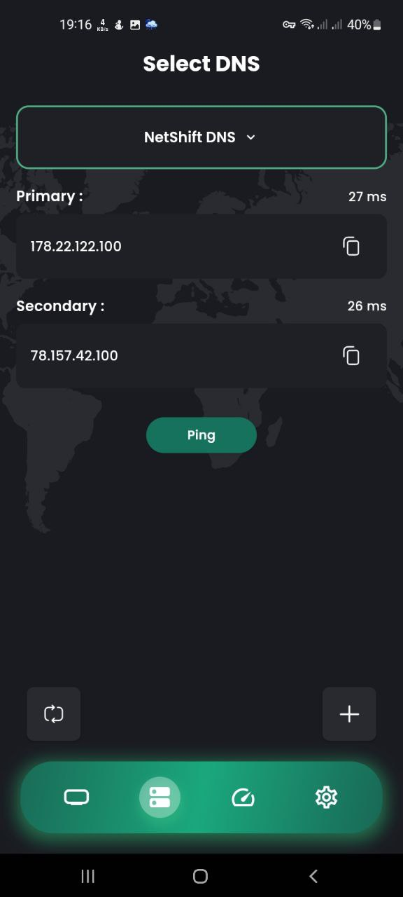
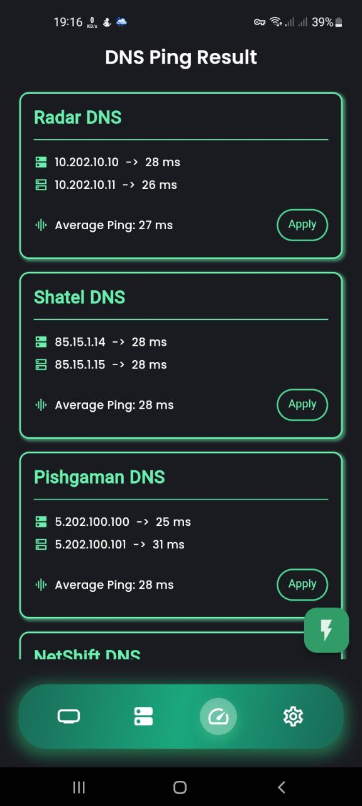
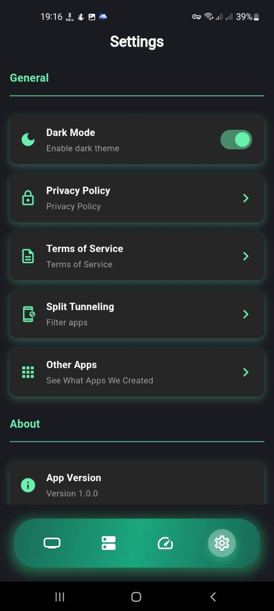
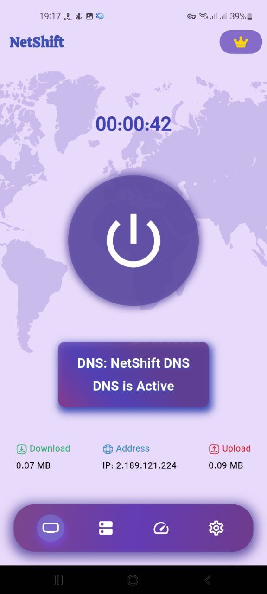
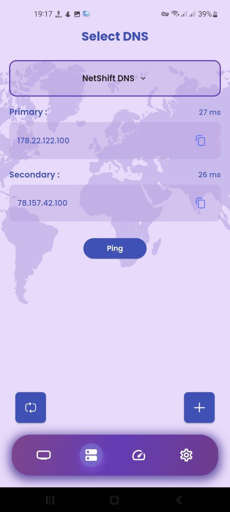
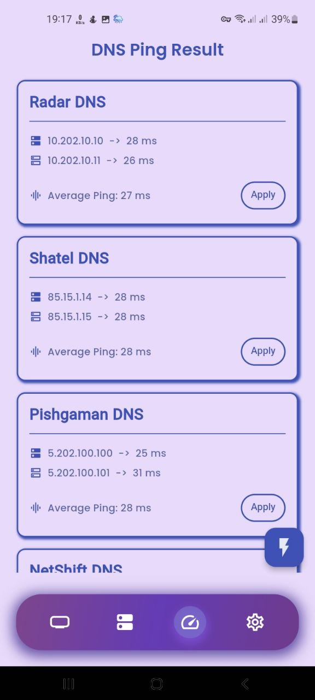
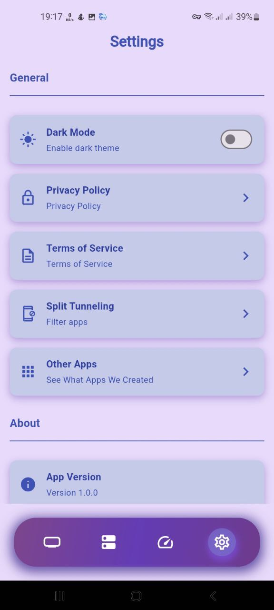
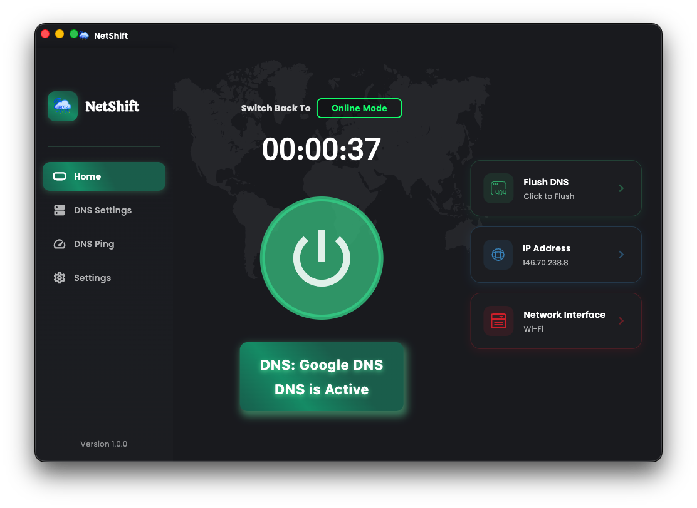

# NetShift: DNS Changer for Windows, macOS & Android

[English](#netshift-dns-changer-for-windows-macos--android) | [فارسی](README_fa.md#توضیحات-برنامه)


<p align="center">
  
</p>

**NetShift** is a user-friendly DNS management tool that helps you switch between different DNS settings with ease. Whether you're optimizing for speed, privacy, or security, NetShift gives you full control over your DNS preferences with a sleek interface and powerful features.

---

## Platforms Supported

| Platform | Status | Min Version |
|----------|--------|-------------|
| Windows  | Stable | Windows 10+ |
| macOS    | Stable | macOS 10.14+ |
| Android  | Stable | Android 5.0+ |

---

## Features at a Glance

- **Instant DNS Switching**
  Quickly change your DNS with just a click. No complex settings, just speed and simplicity.

- **Cross-Platform Support**
  Available on Windows, macOS, and Android with a consistent experience across all platforms.

- **Profile Management**
  Save multiple DNS profiles for different networks or scenarios, making it easier to switch depending on your needs.

- **DNS Ping Testing**
  Test DNS server latencies in real-time to find the fastest servers for your connection.

- **Smooth & Modern Design**
  A clean and responsive interface powered by Flutter ensures a smooth user experience on all screen sizes. Desktop users enjoy an optimized sidebar navigation and larger layouts.

- **Auto & Manual Options**
  Automatically configure DNS or customize each DNS entry manually—perfect for advanced users.

- **Network Interface Selection** (Windows/macOS)
  Choose which network interface to configure DNS for - perfect for systems with multiple network connections.

- **Split Tunneling** (Android)
  Filter which apps use the DNS configuration with per-app control.

---

## Application Screenshots

### Mobile Interface

<p align="center">
  
  
  
  
</p>

_Easily manage DNS settings with a clean and intuitive interface._

---

### DNS Configuration and Settings

<p align="center">
  
  
  
  
</p>

_Customize DNS settings manually or use automatic configuration for faster results._

### Desktop Interface

<p align="center">
  
</p>

---

## Getting Started

### Download

| Platform | Download |
|----------|----------|
| Android  | [Download APK](https://github.com/FarzinNs83/NetShift/releases/download/V.1.0.4/NetShift-Universal-Android.apk) |
| Windows  | [Download EXE](https://github.com/FarzinNs83/NetShift/releases/download/V.1.0.4/NetShift.exe) |
| macOS    | Coming Soon |

### Installation

**Windows:**
Run the installer and follow the setup instructions. Administrator privileges are required to modify DNS settings.

**macOS:**
Download the .app file and drag it to your Applications folder. The app will request administrator privileges when changing DNS settings.

**Android:**
Install the APK and grant VPN permissions when prompted. This is required for DNS configuration on Android.

### Launch & Configure

After installation, launch the app to create and manage DNS profiles. Switch between profiles instantly and easily configure DNS for your system.

---

## System Requirements

### Windows
- Windows 10 or newer
- Administrator privileges for DNS changes

### macOS
- macOS 10.14 (Mojave) or newer
- Administrator privileges for DNS changes

### Android
- Android 5.0 (Lollipop) or newer
- VPN permission required

### Development
If you're interested in customizing or contributing, make sure Dart and Flutter are set up on your system.

---

## Building from Source

```bash
# Clone the repository
git clone https://github.com/FarzinNs83/NetShift.git
cd NetShift

# Install dependencies
flutter pub get

# Run on your platform
flutter run -d windows  # For Windows
flutter run -d macos    # For macOS
flutter run -d android  # For Android

# Build release
flutter build windows
flutter build macos
flutter build apk
```

---

## Contributing to NetShift

Want to help make NetShift even better? Contributions are always welcome!

### How to Contribute:
1. **Fork the Project**
   Clone your fork locally to work on it.

2. **Create a New Branch**
   Implement your changes on a new branch.

3. **Submit a Pull Request**
   When you're ready, submit a pull request for review.

Have suggestions, feature requests, or bug reports? Join our community on [Telegram](https://t.me/flutterstuff) or send feedback directly to the project maintainer.

---

## Contact Us

Need help or have any questions? We're here to assist:

- **Email**: [farzinns83@gmail.com](mailto:farzinns83@gmail.com)
- **Telegram**: [Feri](https://t.me/feri_ns83)
- **Community Channel**: [Flutter Stuff](https://t.me/flutterstuff)

---

## Contributors

- [Jamalianpour](https://github.com/Jamalianpour)
  Responsible for adding full macOS support and performing a comprehensive refactor, including code cleanup, structural improvements, and cross-platform compatibility enhancements.

---

## Showcase Your Setup!

We'd love to see how you're using NetShift! Share your setup or custom DNS profiles on our Telegram channel, and let's build a better experience together.
