# 🛡️ NetShift: DNS Changer for Windows

  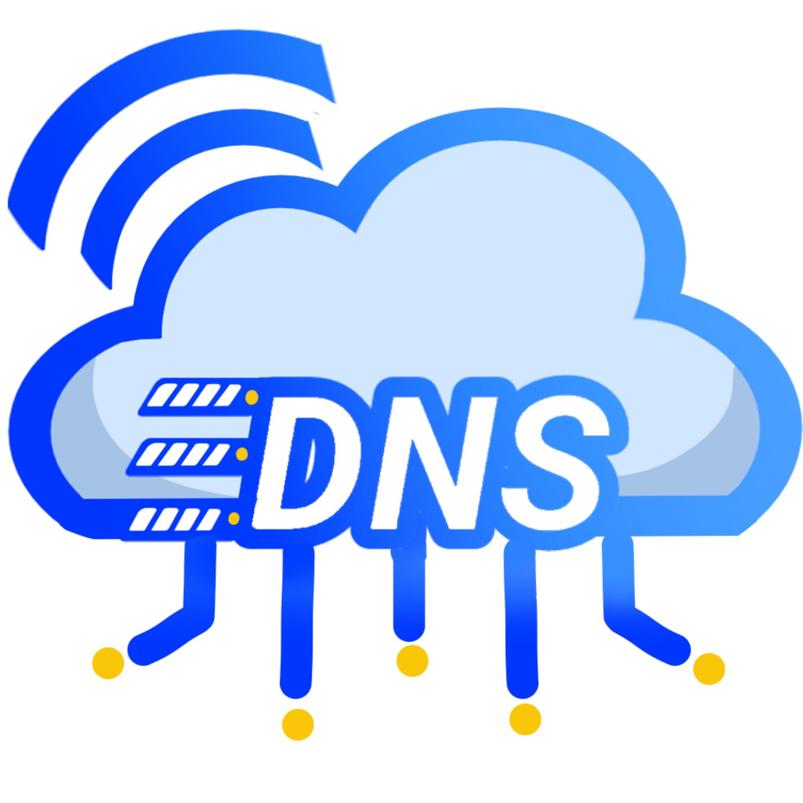

**NetShift** is a user-friendly DNS management tool that helps you switch between different DNS settings with ease. Whether you're optimizing for speed, privacy, or security, NetShift gives you full control over your DNS preferences with a sleek interface and powerful features.

---

## 🏆 Features at a Glance

- **Instant DNS Switching**  
  Quickly change your DNS with just a click. No complex settings, just speed and simplicity.

- **Profile Management**  
  Save multiple DNS profiles for different networks or scenarios, making it easier to switch depending on your needs.

- **Smooth & Modern Design**  
  A clean and responsive interface powered by Flutter ensures a smooth user experience on all screen sizes.

- **Auto & Manual Options**  
  Automatically configure DNS or customize each DNS entry manually—perfect for advanced users.

- **Optimized for Stability**  
  Engineered for high performance on Windows 10 and above. Reliable, fast, and stable for everyday use.

---

## 🖥️ Application Screenshots

### Main Screen and Profile Management

  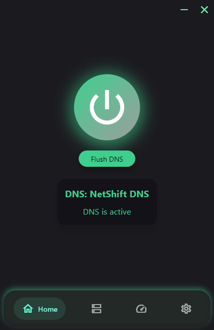  
  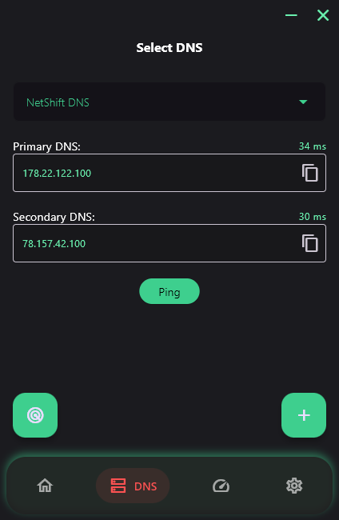  
  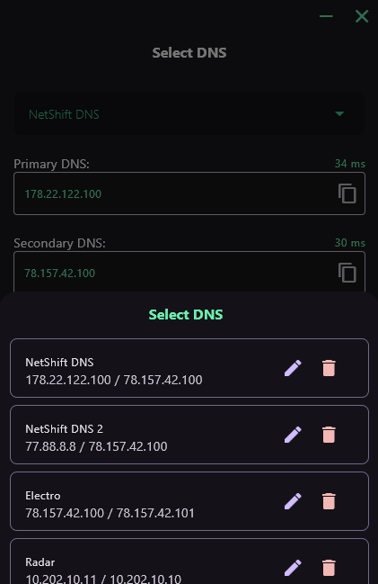  

  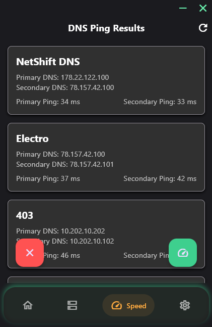  
  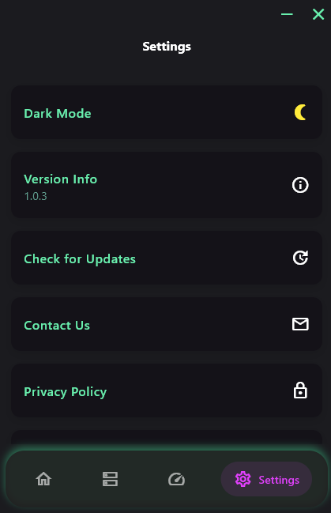

_Easily manage DNS settings with a clean and intuitive interface._

---

### Advanced DNS and Settings Management

  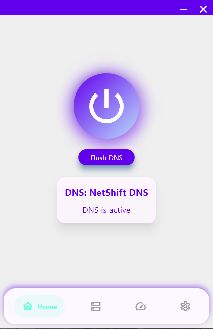  
  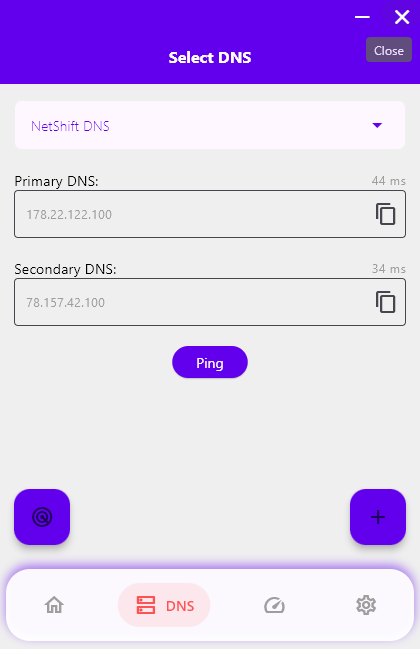  
  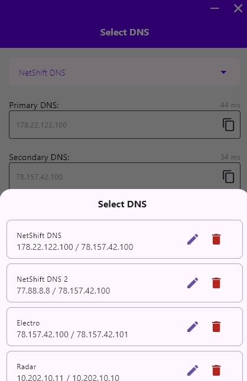  

  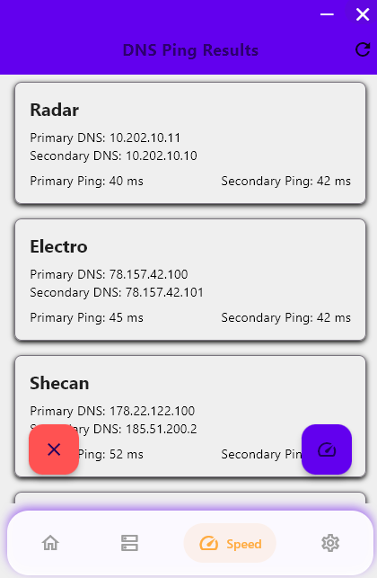  
  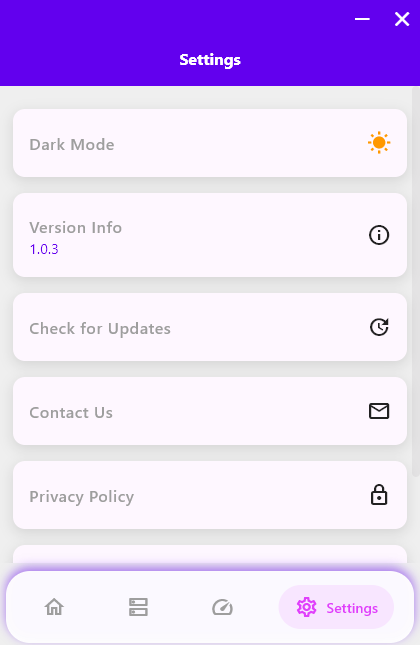

_Customize DNS settings manually or use automatic configuration for faster results._

---

## ⚡ Getting Started

1. **Download NetShift**  
   Grab the latest version of NetShift by [clicking here](https://github.com/FarzinNs83/NetShift/releases/download/V.1.0.3/NetShift.exe).

2. **Installation**  
   Run the installer and follow the setup instructions.

3. **Launch & Configure**  
   After installation, launch the app to create and manage DNS profiles. Switch between profiles instantly and easily configure DNS for your system.

---

## 🔧 System Requirements

- **Operating System**:  
  Compatible with Windows 10 and newer.

- **Development**:  
  If you're interested in customizing or contributing, make sure Dart and Flutter are set up on your system.

---

## 🛠️ Contributing to NetShift

Want to help make NetShift even better? Contributions are always welcome!

### How to Contribute:
1. **Fork the Project**  
   Clone your fork locally to work on it.

2. **Create a New Branch**  
   Implement your changes on a new branch.

3. **Submit a Pull Request**  
   When you're ready, submit a pull request for review.

Have suggestions, feature requests, or bug reports? Join our community on [Telegram](https://t.me/flutterstuff) or send feedback directly to the project maintainer.

---

## 📞 Contact Us

Need help or have any questions? We're here to assist:

- **Email**: [farzinns83@gmail.com](mailto:farzinns83@gmail.com)
- **Telegram**: [Feri](https://t.me/feri_ns83)
- **Community Channel**: [Flutter Stuff](https://t.me/flutterstuff)

---

## 📸 Showcase Your Setup!

We’d love to see how you're using NetShift! Share your setup or custom DNS profiles on our Telegram channel, and let’s build a better experience together.
