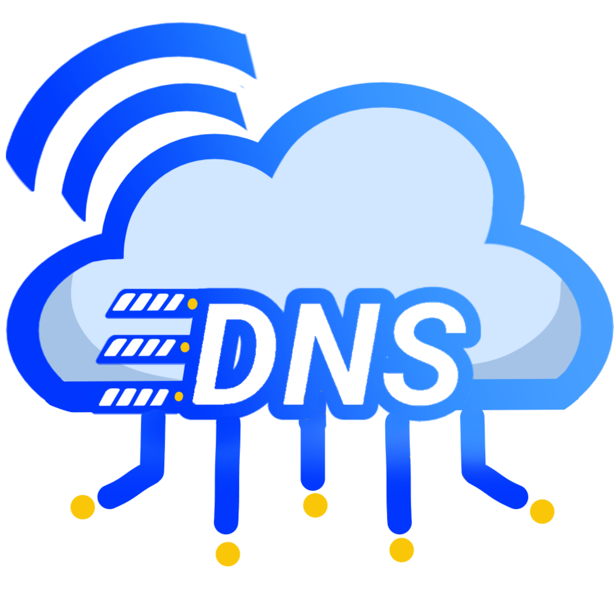
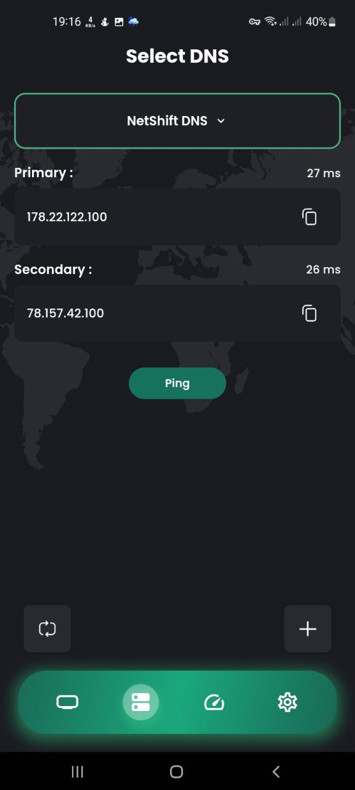
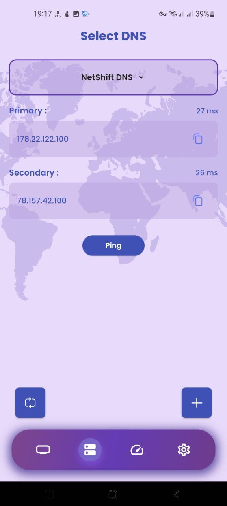
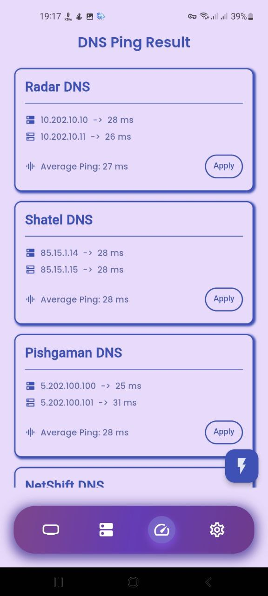

# NetShift: ابزار تغییر DNS برای ویندوز، مک و اندروید

<p align="center">
  
</p>

**NetShift** یک ابزار مدیریت DNS کاربرپسند است که به شما کمک می‌کند به راحتی بین تنظیمات مختلف DNS جابجا شوید. چه به دنبال بهینه‌سازی سرعت باشید، چه حفظ حریم خصوصی یا افزایش امنیت، NetShift کنترل کامل بر روی تنظیمات DNS شما را با یک رابط کاربری شیک و قابلیت‌های قدرتمند در اختیارتان قرار می‌دهد.

---

## پلتفرم‌های پشتیبانی شده

| پلتفرم | وضعیت | حداقل نسخه |
|--------|-------|------------|
| ویندوز | پایدار | ویندوز 10+ |
| مک | پایدار | macOS 10.14+ |
| اندروید | پایدار | اندروید 5.0+ |

---

## ویژگی‌ها در یک نگاه

- **تغییر سریع DNS**
  تنها با یک کلیک DNS خود را تغییر دهید. بدون تنظیمات پیچیده، فقط سرعت و سادگی.

- **پشتیبانی چند پلتفرمی**
  در ویندوز، مک و اندروید با تجربه‌ای یکسان در تمام پلتفرم‌ها در دسترس است.

- **مدیریت پروفایل‌ها**
  چندین پروفایل DNS برای شبکه‌ها یا سناریوهای مختلف ذخیره کنید و بسته به نیازتان به راحتی جابجا شوید.

- **تست پینگ DNS**
  تأخیر سرورهای DNS را در زمان واقعی تست کنید تا سریع‌ترین سرورها را برای اتصال خود پیدا کنید.

- **طراحی مدرن و روان**
  یک رابط کاربری تمیز و واکنش‌گرا که با Flutter طراحی شده و تجربه‌ای روان را در تمام اندازه‌های صفحه نمایش فراهم می‌کند. کاربران دسکتاپ از ناوبری سایدبار بهینه‌شده و طرح‌بندی‌های بزرگ‌تر بهره‌مند می‌شوند.

- **تنظیمات خودکار و دستی**
  به صورت خودکار DNS را پیکربندی کنید یا هر ورودی DNS را به صورت دستی تنظیم کنید—مناسب برای کاربران حرفه‌ای.

- **انتخاب رابط شبکه** (ویندوز/مک)
  انتخاب کنید که DNS برای کدام رابط شبکه پیکربندی شود - مناسب برای سیستم‌هایی با چندین اتصال شبکه.

- **تونل‌زنی تفکیکی** (اندروید)
  فیلتر کنید که کدام اپلیکیشن‌ها از پیکربندی DNS استفاده کنند با کنترل جداگانه برای هر برنامه.

---

## اسکرین‌شات‌های برنامه

### رابط کاربری موبایل

<p align="center">
  
  
  
  
</p>

_تنظیمات DNS را به راحتی و با رابطی تمیز و کاربرپسند مدیریت کنید._

---

### پیکربندی DNS و تنظیمات

<p align="center">
  
  
  
  
</p>

_تنظیمات DNS را به صورت دستی شخصی‌سازی کنید یا از پیکربندی خودکار برای نتایج سریع‌تر استفاده کنید._

### رابط کاربری دسکتاپ

<p align="center">
  
</p>

---

## شروع به کار

### دانلود

| پلتفرم | دانلود |
|--------|--------|
| اندروید | [دانلود APK](https://github.com/FarzinNs83/NetShift/releases/download/V.1.0.4/NetShift-Universal-Android.apk) |
| ویندوز | [دانلود EXE](https://github.com/FarzinNs83/NetShift/releases/download/V.1.0.4/NetShift.exe) |
| مک | به زودی |

### نصب

**ویندوز:**
نصب‌کننده را اجرا کرده و دستورالعمل‌های نصب را دنبال کنید. دسترسی مدیر برای تغییر تنظیمات DNS مورد نیاز است.

**مک:**
فایل .app را دانلود کرده و به پوشه Applications بکشید. برنامه هنگام تغییر تنظیمات DNS درخواست دسترسی مدیر می‌کند.

**اندروید:**
فایل APK را نصب کرده و مجوز VPN را هنگام درخواست بدهید. این مجوز برای پیکربندی DNS در اندروید مورد نیاز است.

### اجرا و پیکربندی

پس از نصب، برنامه را باز کنید تا پروفایل‌های DNS را ایجاد و مدیریت کنید. بین پروفایل‌ها به راحتی جابجا شوید و تنظیمات DNS سیستم خود را پیکربندی کنید.

---

## الزامات سیستم

### ویندوز
- ویندوز 10 یا جدیدتر
- دسترسی مدیر برای تغییرات DNS

### مک
- macOS 10.14 (Mojave) یا جدیدتر
- دسترسی مدیر برای تغییرات DNS

### اندروید
- اندروید 5.0 (Lollipop) یا جدیدتر
- مجوز VPN مورد نیاز است

### توسعه
اگر قصد توسعه یا مشارکت دارید، مطمئن شوید که Dart و Flutter روی سیستم شما نصب شده باشند.

---

## ساخت از سورس

```bash
# کلون کردن مخزن
git clone https://github.com/FarzinNs83/NetShift.git
cd NetShift

# نصب وابستگی‌ها
flutter pub get

# اجرا روی پلتفرم شما
flutter run -d windows  # برای ویندوز
flutter run -d macos    # برای مک
flutter run -d android  # برای اندروید

# ساخت نسخه انتشار
flutter build windows
flutter build macos
flutter build apk
```

---

## مشارکت در توسعه NetShift

آیا می‌خواهید به بهبود NetShift کمک کنید؟ مشارکت‌ها همیشه خوش‌آمد هستند!

### مراحل مشارکت:
1. **فورک کردن پروژه**
   پروژه را فورک کرده و آن را به صورت محلی کلون کنید.

2. **ایجاد یک شاخه جدید**
   تغییرات خود را روی یک شاخه جدید پیاده‌سازی کنید.

3. **ارسال Pull Request**
   وقتی آماده شدید، یک Pull Request برای بررسی ارسال کنید.

پیشنهادات، درخواست ویژگی‌ها یا گزارش مشکلات دارید؟ به جامعه ما در [تلگرام](https://t.me/flutterstuff) بپیوندید یا مستقیماً با نگهدارنده پروژه تماس بگیرید.

---

## تماس با ما

به کمک نیاز دارید یا سوالی دارید؟ ما اینجا هستیم تا به شما کمک کنیم:

- **ایمیل**: [farzinns83@gmail.com](mailto:farzinns83@gmail.com)
- **تلگرام**: [Feri](https://t.me/feri_ns83)
- **کانال جامعه**: [Flutter Stuff](https://t.me/flutterstuff)

---

## تنظیمات خود را به اشتراک بگذارید!

ما دوست داریم ببینیم چطور از NetShift استفاده می‌کنید! تنظیمات یا پروفایل‌های سفارشی DNS خود را در کانال تلگرام ما به اشتراک بگذارید تا تجربه‌ای بهتر با هم بسازیم.
